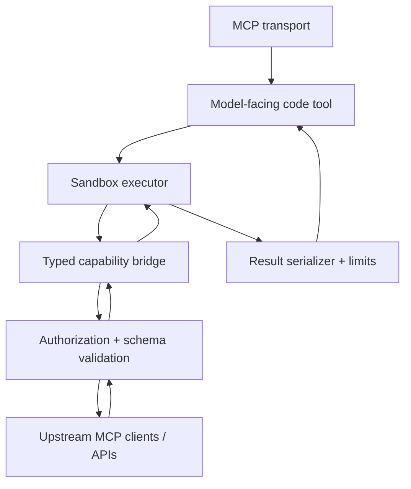

# Build the server

A production Code Execution MCP has four security-relevant layers. Keep them separate so each can be replaced or audited independently.



## Component boundaries

### MCP adapter

Responsibilities:

- expose the small model-facing tool surface;
- validate the `execute_code` request itself;
- map execution failures into stable structured errors;
- carry principal / session / tenant identity into the execution context.

Do not put sandbox implementation details or credentials in the MCP tool description.

### Catalog and discovery

The hidden catalog is the authoritative set of capabilities the sandbox may request.

For each capability, retain:

```ts
type Capability = {
  id: string;
  description: string;
  inputSchema: JsonSchema;
  outputSchema?: JsonSchema;
  mutatesState: boolean;
  requiresApproval?: boolean;
  invoke(args: unknown, ctx: HostContext): Promise<JsonValue>;
};
```

Two discovery strategies are useful:

**Generated bindings** — generate TypeScript declarations or runtime wrappers for every allowed capability and make them available to the sandbox. Use this when the catalog is moderate.

**Search \+ execute** — expose a compact search operation that returns only relevant operation metadata, then allow execution by stable operation ID. Use this when loading the complete schema would defeat the context savings.

<Note>
  Cloudflare's current Code Mode documentation uses the same split: a single `code` tool with typed methods, or `search` \+ `execute` for very large API surfaces.
</Note>

## Typed bridge design

Prefer this model-facing shape:

```ts
await tools.github.searchIssues({ query: "is:open label:bug" });
```

over an untyped shape:

```ts
await call("github.searchIssues", { query: "is:open label:bug" });
```

Typed bindings give the LLM stronger names, argument structure, and editor/compiler feedback. The host must still validate the real JSON Schema at invocation time.

A wrapper may be generated mechanically:

```ts
function createBinding(capability: Capability, bridge: HostBridge) {
  return async (args: unknown) => {
    return bridge.invoke(capability.id, args);
  };
}
```

The wrapper is **not trusted**. `bridge.invoke()` is the policy boundary.

## Host tool gateway

Every invocation should run through this sequence:

```text
resolve capability
→ authorize principal
→ check approval policy
→ validate input schema
→ consume execution budget
→ call upstream tool
→ validate / normalize output
→ record audit event
→ return serializable value
```

Recommended structured errors:

| Code | Meaning | Agent action |
| --- | --- | --- |
| `tool_not_found` | Capability does not exist | Discover again; do not guess |
| `invalid_arguments` | Input schema rejected args | Fix arguments using the schema |
| `forbidden` | Principal cannot invoke capability | Stop; do not bypass |
| `approval_required` | Human approval is required | Surface the requirement to the client |
| `tool_failed` | Upstream tool failed | Inspect safe error details; retry only if appropriate |
| `budget_exceeded` | Call/time/output budget exhausted | Return partial result or simplify |
| `execution_timeout` | Program exceeded wall time | Reduce work; do not increase limits blindly |

## Sandbox contract

Generated source is untrusted input. The runtime must be disposable or strongly isolated.

### Deny by default

The sandbox should have no ambient authority for:

- host filesystem;
- process creation;
- environment secrets;
- raw sockets or unrestricted `fetch`;
- package installation;
- native modules;
- host runtime reflection / escape primitives.

Only inject explicit, narrow capabilities.

### Budgets

Track budgets in the host, not only inside generated code:

```ts
type ExecutionBudget = {
  wallTimeMs: number;
  cpuTimeMs?: number;
  memoryBytes: number;
  maxToolCalls: number;
  maxResultBytes: number;
  maxLogBytes: number;
};
```

Set sane server-side maxima. A model-provided timeout may request _less_ time but should not be able to exceed policy.

## Authentication and secrets

Keep authentication outside the model and outside generated source.

Good flow:

```text
model code
  → typed tool binding
  → opaque bridge request
  → host resolves auth for principal + capability
  → upstream call with credentials
```

Bad flow:

```text
model receives API token
  → token embedded in generated JavaScript
  → arbitrary code can print or exfiltrate it
```

If different upstream tools require different credentials, resolve them per capability at the gateway.

## Result handling

The executor should return only JSON-compatible values or a narrowly defined richer result type.

Reject or normalize:

- functions;
- class instances;
- cyclic objects;
- raw file descriptors / sockets;
- secret-bearing error objects;
- extremely large strings or arrays.

Recommended envelope:

```ts
type ExecutionResult =
  | {
      ok: true;
      result: JsonValue;
      metrics: { durationMs: number; toolCalls: number };
    }
  | {
      ok: false;
      error: {
        code: string;
        message: string;
        retryable: boolean;
        location?: { line?: number; column?: number };
      };
    };
```

Do not return full sandbox internals or stack traces to the LLM if they contain host paths, secrets, or implementation details.

## Parallelism

Allow model code to use normal concurrency for independent calls:

```ts
const [repo, issues, pulls] = await Promise.all([
  tools.github.getRepo({ owner, repo }),
  tools.github.searchIssues({ query: `repo:${owner}/${repo} is:open` }),
  tools.github.searchPullRequests({ query: `repo:${owner}/${repo} is:open` }),
]);

return {
  stars: repo.stargazers_count,
  openIssues: issues.total,
  openPulls: pulls.total,
};
```

The gateway should enforce both per-execution and global concurrency limits so `Promise.all()` cannot create unbounded fan-out.

## Mutating tools

Read-only tools are the safest first milestone. For writes:

1. classify every capability as read or mutation;
2. require an explicit authorization policy for mutations;
3. preserve client/user approval semantics where required;
4. support idempotency keys when the upstream system does;
5. do not automatically retry non-idempotent writes;
6. audit the exact principal, capability, validated arguments, and result status.

## Single-tool vs search-and-execute

### Single code tool

Choose this when generated bindings remain compact enough to provide to the model. The server exposes one MCP tool and the runtime receives typed methods for the hidden catalog.

### Search \+ execute

Choose this when the catalog is very large. Search should return only enough metadata for the model to select operations. Execution should accept a stable operation identifier plus validated arguments. The generated program may search first, then invoke discovered operations through a constrained request function.

Do not make search results executable source. Treat descriptions and schemas as data.

## Implementation checklist

- [ ] one small MCP-facing tool surface
- [ ] authoritative hidden catalog
- [ ] stable capability IDs
- [ ] generated or searchable schemas
- [ ] isolated execution runtime
- [ ] host-side authorization on every call
- [ ] host-side JSON Schema validation
- [ ] no model-visible secrets
- [ ] call/time/memory/output budgets
- [ ] structured errors
- [ ] audit logging
- [ ] mutation classification and approval policy
- [ ] concurrency bounds
- [ ] deterministic result serialization

Next: teach the model how to operate this interface in [LLM operating guide](/agent-usage).