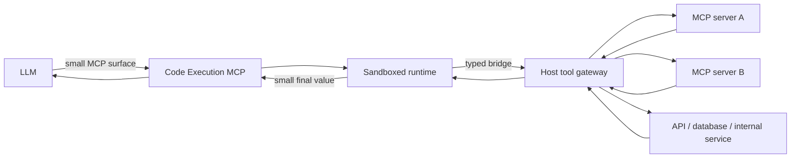

# Code Execution MCP

Use this documentation when an LLM must **build, expose, or operate an MCP server whose primary interface is executable code** rather than dozens or hundreds of direct tool calls.

<Note>
  **Code Execution MCP / Code Mode is an architectural pattern, not a separate MCP protocol.** The server is still an MCP server. What changes is the model-facing tool surface: the model receives one small code-execution interface, or a small search-and-execute interface, while the host keeps the larger tool catalog behind that boundary.
</Note>

## Agent objective

When you are the implementing or operating LLM, optimize for these properties in this order:

1. **Correctness** — call only real tools with schema-valid arguments.
2. **Isolation** — treat generated code as untrusted and execute it in a sandbox.
3. **Least context** — do not load the full upstream tool catalog unless necessary.
4. **Composition** — keep intermediate data inside the runtime and return only the compact result needed by the model.
5. **Auditability** — every privileged host-side tool call must be attributable, bounded, and loggable.

## Mental model



The important boundary is between the **sandbox** and the **host tool gateway**. Generated code must never receive raw credentials, unrestricted process access, or unrestricted network access merely because the host has them.

## Choose a model-facing pattern

| Pattern | Exposed MCP tools | Use when | Discovery cost |
| --- | --- | --- | --- |
| **Single code tool** | `code` or `execute_code` | The hidden catalog is moderate and typed bindings can be generated up front | Low and fixed |
| **Search \+ execute** | `search`, `execute` | The hidden catalog or API schema is too large to preload | Lowest for very large catalogs |
| **Direct MCP tools** | Every tool | The server exposes only a few simple tools or code execution adds no value | Grows with catalog size |

<Info>
  Cloudflare documents the first two patterns as **single code tool** and **search and execute**. Anthropic describes the broader motivation: keep tool definitions and intermediate tool results out of the model context when possible.
</Info>

## Recommended contract

The following is a **recommended implementation contract**, not an MCP-standard tool name:

```ts
execute_code({
  code: string,
  timeout_ms?: number
}) -> {
  ok: boolean,
  result?: JsonValue,
  error?: {
    code: string,
    message: string,
    retryable?: boolean
  },
  metrics?: {
    duration_ms?: number,
    tool_calls?: number
  }
}
```

Inside the runtime, expose **typed bindings** for allowed upstream operations. For example:

```ts
const issues = await tools.github.searchIssues({
  query: "repo:acme/api is:open label:bug"
});

const highPriority = issues.items
  .filter((issue) => issue.labels.includes("priority:high"))
  .map(({ number, title, url }) => ({ number, title, url }));

return highPriority;
```

The exact namespace is implementation-defined. Prefer generated types and stable names over a generic untyped `call(name, args)` API when the catalog is small enough.

## Hard rules for an implementing LLM

- Do **not** evaluate tool-returned strings as code.
- Do **not** inject secrets into generated source code.
- Do **not** let sandbox code bypass host-side authorization or schema validation.
- Do **not** make the sandbox itself the security policy. Re-check permissions at the host bridge.
- Do **not** return huge raw upstream responses if a filtered or aggregated value is sufficient.
- Do **not** invent tool names or parameters. Discover or derive them from authoritative schemas.
- Prefer one composed execution over a long sequence of model → tool → model round trips when the operations belong to one deterministic workflow.

## When code execution is worth it

Code execution is especially useful when the task needs one or more of the following:

- several dependent tool calls;
- fan-out / fan-in calls that can run in parallel;
- filtering or joining large intermediate results;
- loops, branching, retries, parsing, or aggregation;
- a large MCP catalog where tool definitions would dominate context;
- a need to return only a small derived result to the model.

Use direct MCP calls instead when there are only a few tools and each request is independent and already compact.

<CardGroup cols={2}>
  <Card title="Quickstart" icon="rocket" href="/quickstart">
    Build the minimal safe version.
  </Card>

  <Card title="Build the server" icon="server" href="/build-server">
    Architecture, bridge contract, sandbox, discovery, and result handling.
  </Card>

  <Card title="LLM operating guide" icon="brain" href="/agent-usage">
    How an agent should discover, plan, execute, recover, and return results.
  </Card>

  <Card title="Security and tests" icon="shield" href="/security-testing">
    Threat boundaries and a production-oriented test matrix.
  </Card>
</CardGroup>

## Primary references

- [Anthropic — Code execution with MCP](https://www.anthropic.com/engineering/code-execution-with-mcp)
- [Model Context Protocol — current specification](https://modelcontextprotocol.io/specification/2026-07-28)
- [Cloudflare — Code Mode MCP server patterns](https://developers.cloudflare.com/agents/model-context-protocol/codemode/)